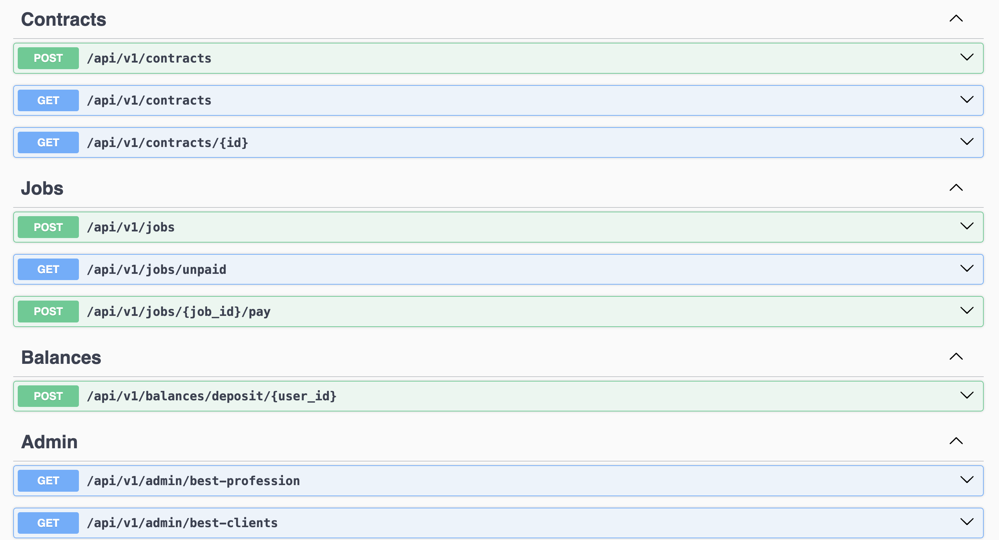

# Contract and Payment Service

## Overview

The Contract and Payment Service is designed to manage contracts and payments between clients and contractors. Key features include transaction handling, concurrency management, and efficient database querying.

## Live URL

   ```bash
   https://contract-payment-service.onrender.com
   ```

## Getting Started

1. **Clone the Repository:**

   ```bash
   git clone https://github.com/belovetech/contract_payment_service.git
   cd contract-payment-service
   ```

2. **Install Dependencies:**

   ```bash
   npm install
   ```

3. **Set Up the Database:**

   Configure PostgreSQL and update your `.env` file. Run migrations:

   ```bash
   npm run db:migrate
   ```

4. **Seed the Database:**

   ```bash
   npm run db:seed
   ```

5. **Start the Application:**

   ```bash
   npm run start:dev
   ```

6. **Run Tests:**

   ```bash
   npm run test
   ```

7. **Swagger Documentation:**

   Access the Swagger docs at: `https://contract-payment-service.onrender.com/api/v1/docs`

   

## Docker Setup

1. **Create Docker Environment Files:**

   Ensure `.env.docker` and `.env.docker.test` files are set up based on .env.sample.

2. **Start Docker Containers:**

   ```bash
   npm run docker:start
   ```

3. **Stop Docker Containers:**

   ```bash
   npm run docker:stop
   ```

4. **Run Tests in Docker Container:**

   ```bash
   npm run docker:test:start
   npm run docker:test:exec
   ```

## Approach and Decisions

### 1. Authentication

**Current Approach:** The authentication mechanism uses the `id` column (an integer) from the `profiles` table, identified by the header name `profile_id`. This method is straightforward and simplifies testing by using integer IDs.

**Considerations:**

- **Scalability and Flexibility:** In a production environment, UUIDs or ULIDs would typically be used instead of integers. UUIDs (Universally Unique Identifiers) or ULIDs (Universally Unique Lexicographically Sortable Identifiers) offer better scalability and sorting capabilities, making it easier to manage and query large datasets.
- **Testing Simplicity:** Using integers for profile IDs simplifies the testing and implementation phase, especially in a case study or assessment scenario where ease of implementation is prioritized over advanced features.

### 2. Transactions and Locks

**Current Approach:** To ensure data integrity and prevent race conditions, all database operations are performed within a single interactive transaction using Prisma. This approach maintains atomicity, ensuring that all operations within the transaction are completed successfully before committing changes.

**Considerations:**

- **Atomicity:** Prisma’s interactive transactions are used to guarantee that all operations within a transaction are treated as a single unit of work. If any operation fails, the transaction is rolled back, preserving the consistency of the database.
- **Isolation Level:** PostgreSQL’s default `read committed` isolation level is used, which is suitable for our use case. This isolation level prevents dirty reads and ensures that transactions do not interfere with each other, avoiding issues like deadlocks.

### 3. Handling Race Conditions

**Current Approach:** A single transaction context is used to handle race conditions. This means that all database operations related to a particular transaction are executed as one indivisible unit.

**Considerations:**

- **Atomicity:** By grouping all related database operations into a single transaction, we ensure that they are executed sequentially and as a cohesive unit. This approach minimizes the risk of race conditions, where concurrent operations could lead to inconsistent or erroneous data states.

### 4. Payment for Jobs

**Current Approach:** It is assumed that a client will always pay for a job in full. This simplification avoids the need for additional mechanisms to handle partial payments.

**Considerations:**

- **Partial Payments:** If partial payments were allowed, additional database columns would be necessary to track payment balances. Furthermore, implementing idempotency mechanisms would be crucial to prevent issues such as duplicate payments or concurrent transactions affecting the same job.
- **Idempotency:** Idempotency ensures that repeated transactions do not lead to unintended side effects. This is especially important in systems handling financial transactions to avoid processing the same payment multiple times.

### 5. Creating Extra Endpoints

**Current Approach:** To facilitate comprehensive testing, five additional endpoints were implemented. These endpoints include functionality for creating profiles, jobs, and contracts, among others.

**Considerations:**

- **Testing Coverage:** The extra endpoints and a robust seeding script were designed to populate the database with a variety of test data. This ensures that all features and edge cases are thoroughly tested, providing a more complete validation of the system’s capabilities.
- **Data Seeding:** The seeding process systematically generates diverse data scenarios, allowing for effective testing of core functionalities and ensuring that the system can handle various use cases and conditions.
